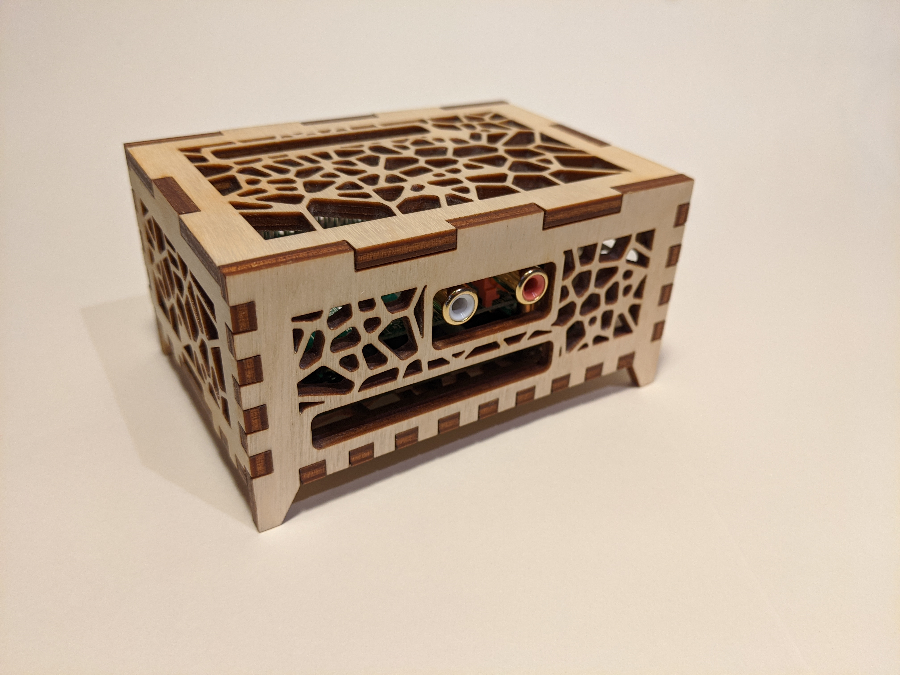
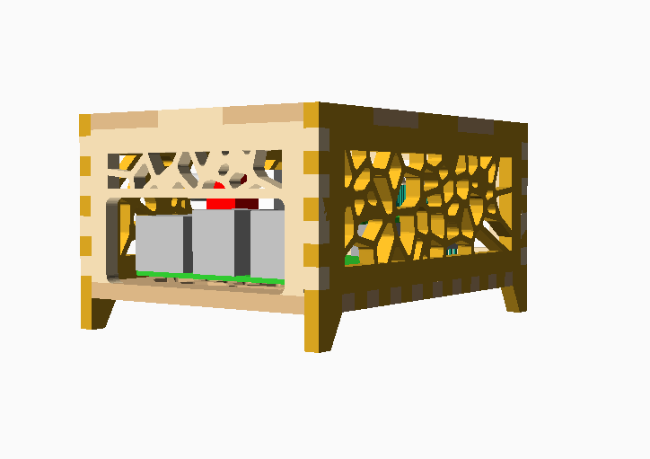
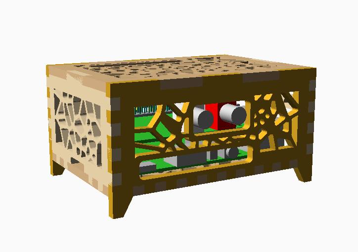
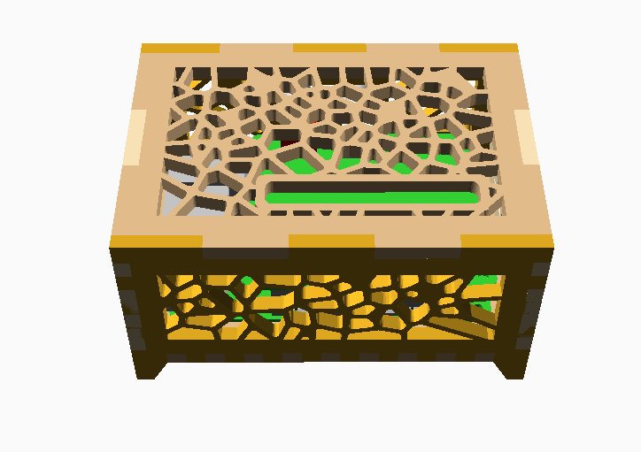

# Raspberry Pi & HiFi Berry Case
Customizable, laser cut case for Raspberry Pi 3 and 4 with room for a HiFi Berry DAC+ HAT. The case provides access to all Pi IO ports as well as the RCA connectors and GPIO pins on the HiFi Berry.

| | |
|-|-|
|||
|||

The layout is provided as an [SVG](./pi4_case.svg) for 4mm thick multiplex (plywood) that can be cut immediately without any modifications. A customizable version is provided as an [OpenSCAD] design: (https://github.com/openscad/openscad#readme) [pi4_case.scad](./pi4_case.svg).  

As provided, the fit is very tight, but everything fits as expected. You may need to add one or two washers as spacers under the pi to get the Pi IO ports to align exactl with the front opening.

The material thickness can be changed by editing the `.scad` file and adjusting `material = ` to match the average thickness of the multiplex. It is also possible to use the OpenSCAD customizer panel to make these adjustments.

To adjust dimensions, edit the `.scad` file in OpenSCAD and do the following:
* Clone this repo or at minimum download:
  * `pi4_case.scad`
  * `finger_joint_box.scad`
  * `raspberrypi.scad`
  * `voronoi.scad`
* Adjust the `material` variable to match the thickness of your material
* To prepare for laser cutting, use `Design > Render (F6)`
  * Export the design `Export > Export as SVG`
* To view the model in 3D, use the customizer `Display > ThreeD` tick box
